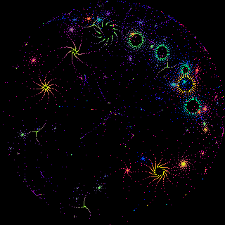

# Bubble Universe for PicoCalc

    

Ported from the bubble universe examples by https://github.com/movievertigo

Original algorithm from https://x.com/yuruyurau/status/1226846058728177665

## Controls:

- `Arrows` - scroll viewpoint
- `Enter` - zoom in
- `Back` - zoom out
- `+`/`-` - speed up/down
- `Space` - pause
- `Esc` - reset view
